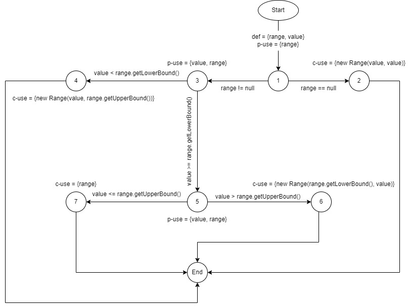

**SENG 438 - Software Testing, Reliability, and Quality**

**Lab. Report #3 – Code Coverage, Adequacy Criteria and Test Case Correlation**

| Group \#:      |     |
| -------------- | --- |
| Student Names: |Bilal Pasha     |
|                |Hamza Niaz     |
|                |Issam Akthar     |
|                |Yousef Hammad     |

(Note that some labs require individual reports while others require one report
for each group. Please see each lab document for details.)

# 1 Introduction

In this lab, we explored new ways of testing code such as white box testing using the JUnit framework. In addition to the JUnit framework, the code coverage software that we decided to use for this lab was the built-in component from eclipse called EclEmma. We decided to use this coverage tool because of not only the convenience of it being built into eclipse, but it covers the statement and branch coverage metrics as well. These tools helped us create a better understanding of code testing and create a solid code coverage for our test suite. With white box testing, it was clear with the coverage to decide how much of the code was being tested by the test cases and how much of it needed more testing. Compared to black box testing, white box testing allowed us to examine the code more thoroughly and in depth. While performing the code coverage with EclEmma, one of the major flaws with EclEmma is the fact that it does not cover the condition coverage metric. In order to compensate for this, we decided to focus on the method coverage metric rather than condition. Method coverage allows us to determine when at least one instruction has been executed within our system. Therefore, the three-coverage metrics that we are deciding to use are Line/Statement, Branch and Method Coverage.

# 2 Manual data-flow coverage calculations for X and Y methods

Def-path set:
- du(1, range) = {[1,2],[1,3,4],[1,3,5,6],[1,3,5,7]}
- du(1, value) = {[1,2],[1,3,4],[1,3,5,6]}

Def-pair set:
- du(1, 4, range) = {[1,3,4]}
- du(1, 7, range) = {[1,3,5,7]}
- du(1, 6, range) = {[1,3,5,6]}
- du(1, 2, value) = {[1,2]}
- du(1, 4, value) = {[1,3,4]}
- du(1, 6, value) = {[1,3,5,6]}

DU Table

| Variable 	| Defined at Node 	| DCU     	| DPU                                   	|   	
|----------	|-----------------	|---------	|---------------------------------------	|
| range    	| 1               	| {4,6,7} 	| {(1,2),(1,3),(3,4),(3,5),(5,6),(5,7)} 	|   	
| value    	| 1               	| {2,4,6} 	| {(3,4),(3,5),(5,6),(5,7)}             	|   	

DU Tests

| Test                                | Pair Covered             |
|-------------------------------------|--------------------------|
| testExpandToIncludeValueInRange()   | dcu {7}, dpu {(1,3,5,7)} |
| testValueGreaterThanMaxLowerBound() | dcu {6}, dpu {(1,3,5,6)} | 
| testValueLessThanMinLowerBound()    | dcu {4}, dpu {(1,3,4)}   |
| testValueGreaterThanMaxUpperBound() | dcu {6}, dpu {(1,3,5,6)} |
| testValueLessThanMinUpperBound()    | dcu {4}, dpu {(1,3,4)}   |
| testNullRangeValueUpperBound()      | dcu {2}, dpu {(1,2)}     |
| testNullRangeValueLowerBound()      | dcu {2}, dpu {(1,2)}     | 
| testNegativeValueLowerBound()       | dcu {4}, dpu {(1,3,4)}   |
| testNegativeValueUpperBound()       | dcu {4}, dpu {(1,3,4)}

# 3 A detailed description of the testing strategy for the new unit test

Text…

# 4 A high level description of five selected test cases you have designed using coverage information, and how they have increased code coverage

Text…

# 5 A detailed report of the coverage achieved of each class and method (a screen shot from the code cover results in green and red color would suffice)

Text…

# 6 Pros and Cons of coverage tools used and Metrics you report

Text…

# 7 A comparison on the advantages and disadvantages of requirements-based test generation and coverage-based test generation.

Text…

# 8 A discussion on how the team work/effort was divided and managed

Text…

# 9 Any difficulties encountered, challenges overcome, and lessons learned from performing the lab

Text…

# 10 Comments/feedback on the lab itself

Text…
