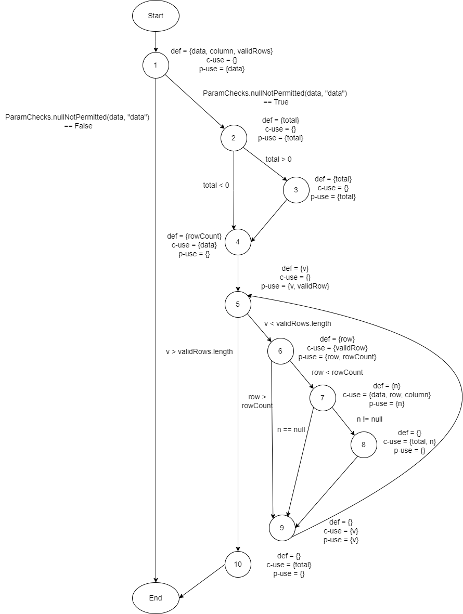
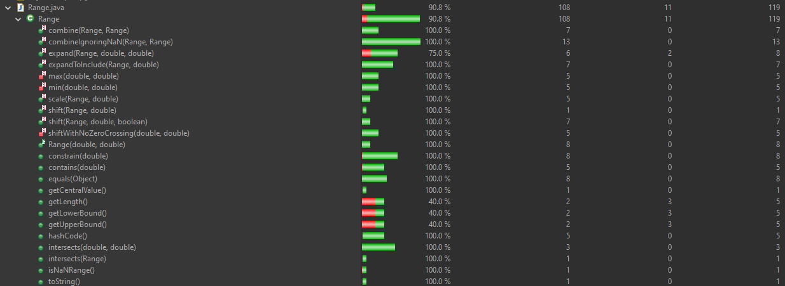

**SENG 438 - Software Testing, Reliability, and Quality**

**Lab. Report #3 – Code Coverage, Adequacy Criteria and Test Case Correlation**

| Group \#:      |     |
| -------------- | --- |
| Student Names: |Bilal Pasha     |
|                |Hamza Niaz     |
|                |Issam Akthar     |
|                |Yousef Hammad     |

(Note that some labs require individual reports while others require one report
for each group. Please see each lab document for details.)

# 1 Introduction

In this lab, we explored new ways of testing code such as white box testing using the JUnit framework. In addition to the JUnit framework, the code coverage software that we decided to use for this lab was the built-in component from eclipse called EclEmma. We decided to use this coverage tool because of not only the convenience of it being built into eclipse, but it covers the statement and branch coverage metrics as well. These tools helped us create a better understanding of code testing and create a solid code coverage for our test suite. With white box testing, it was clear with the coverage to decide how much of the code was being tested by the test cases and how much of it needed more testing. Compared to black box testing, white box testing allowed us to examine the code more thoroughly and in depth. While performing the code coverage with EclEmma, one of the major flaws with EclEmma is the fact that it does not cover the condition coverage metric. In order to compensate for this, we decided to focus on the method coverage metric rather than condition. Method coverage allows us to determine when at least one instruction has been executed within our system. Therefore, the three-coverage metrics that we are deciding to use are Line/Statement, Branch and Method Coverage.

# 2 Manual data-flow coverage calculations for X and Y methods

Def-path set:
- du(1, range) = {[1,2],[1,3,4],[1,3,5,6],[1,3,5,7]}
- du(1, value) = {[1,2],[1,3,4],[1,3,5,6]}

Def-pair set:
- du(1, 4, range) = {[1,3,4]}
- du(1, 7, range) = {[1,3,5,7]}
- du(1, 6, range) = {[1,3,5,6]}
- du(1, 2, value) = {[1,2]}
- du(1, 4, value) = {[1,3,4]}
- du(1, 6, value) = {[1,3,5,6]}

DU Table

| Variable 	| Defined at Node 	| DCU     	| DPU                                   	|   	
|----------	|-----------------	|---------	|---------------------------------------	|
| range    	| 1               	| {4,6,7} 	| {(1,2),(1,3),(3,4),(3,5),(5,6),(5,7)} 	|   	
| value    	| 1               	| {2,4,6} 	| {(3,4),(3,5),(5,6),(5,7)}             	|   	

DU Tests

| Test                                | Pair Covered             |
|-------------------------------------|--------------------------|
| testExpandToIncludeValueInRange()   | dcu {7}, dpu {(1,3,5,7)} |
| testValueGreaterThanMaxLowerBound() | dcu {6}, dpu {(1,3,5,6)} | 
| testValueLessThanMinLowerBound()    | dcu {4}, dpu {(1,3,4)}   |
| testValueGreaterThanMaxUpperBound() | dcu {6}, dpu {(1,3,5,6)} |
| testValueLessThanMinUpperBound()    | dcu {4}, dpu {(1,3,4)}   |
| testNullRangeValueUpperBound()      | dcu {2}, dpu {(1,2)}     |
| testNullRangeValueLowerBound()      | dcu {2}, dpu {(1,2)}     | 
| testNegativeValueLowerBound()       | dcu {4}, dpu {(1,3,4)}   |
| testNegativeValueUpperBound()       | dcu {4}, dpu {(1,3,4)}   |

For the expandToInclude() method, we got a 100% coverage from the test cases and it also shows in the coverage calculation. Since we had 100% coverage, we had no in feasible cases.

CU = 9, PU = 9
Coverage = (CU / PU) x 100%
Coverage = 100%

# 3 A detailed description of the testing strategy for the new unit test

We took a look at the coverage of our test cases from our previous lab before making new ones. It helped us understand the methodology of white box testing and some things that we missed. Before we wrote any new test cases to get better coverage, we took a look at the methods that we wanted to test. We recognized all the possible branches in each method, edge cases that could break the functionally of the methods, and exception handling. We carefully made a list of all the inputs that we were planning to use for each unit test and their expected outcome. Some of the tests were very obvious but we did not want to leave any room for error so we tested everything we could. Most of the methods had some visible flaws just by examining the code and it was easy to write test cases for them but some were very tricky to diagnose. 
Our group split into two pairs and we also split all the methods from the classes being tested in half. Hamza and Bilal worked on one half of the methods and Yousef and Issam worked on the other half of the methods. The goal of each pair was to get as much branch coverage, line coverage and method coverage as possible for their half of the methods. Once each pair was exhaustive with their testing, we switched the method partition with each other. That way, we have the best chance of catching the test cases that the other pair missed. This worked very well for us.

# 4 A high level description of five selected test cases you have designed using coverage information, and how they have increased code coverage

Class: Range
Method: combineIgnoringNaN(Range range1, Range range2)
In our initial test cases from assignment 2, we did not cover this function so we did not really have a good idea about the impact this function could make on the coverage percentages. This function has a total of 14 branches, which is a lot of branches compared to the other functions. This function returns a new range that spans both range1 and range2. This method has a special handling to ignore Double.NaN values. We were able to capture 13 of the 14 branches, all 13 lines, and the method itself with our test cases. We have test cases that cover valid ranges, invalid ranges, null ranges, valid value, invalid value, NaN values, and null values.  The testing of this method contributed the following percentages to the overall coverages:
- Branch: increased 18.3%
- Line: increased 12.3 %
- Method: increased 4.3 %

Class: Range 
Method: Intersects(double b0, double b1)
In our initial test cases from assignment 2, we did have some test cases for this method but they did not have good coverages. This method has a total of 8 branches and 3 lines and we were able to capture all of them with our test cases. This method returns true if the range intersects with the specified range, and false otherwise. We have test cases that cover valid ranges, invalid ranges, and null ranges. The testing of this method continued the following percentages to the overall coverages:
- Branch: increased 11.3%
- Line: increased 2.8 %
- Method: increased 4.3 %

Class: Range
Method: Contains(double value)
In our initial test cases from assignment 2, we did have some test cases for this method and they have good coverages. This method has a total of 8 branches and 5 lines. Some of the branches were hard to capture in our test cases. This method returns true if the range contains the specified value and false otherwise. We have test cases that cover values inside the range, outside the range, and null values. The testing of this method contributed the following percentages to the overall coverages:
- Branch: increased 8.6%
- Line: increased 4.7 %
- Method: increased 4.3 %

# 5 A detailed report of the coverage achieved of each class and method (a screen shot from the code cover results in green and red color would suffice)

#### Range Class

Branch:

Line:

Method:

#### Data Utilities Class

Branch:

Line:

Method:

# 6 Pros and Cons of coverage tools used and Metrics you report

In the lab, we used the recommended coverage tool,  EclEmma, since it is built-in in Eclipse. Even though EclEmma was easy to set up for our testing suite, it has its pros and cons. Some of its pros are:
- EclEmma is a free and open source tool. We were able to access its documentation and get a better understanding of its functionality.
- EclEmma provides an easy analysis of the code being tested by highlighting with green, yellow, and red. Green meaning that the code was captured in our test cases. Yellow meaning that some of the code was captured in our test cases. Red meaning that we did not capture the red highlighted code in our test cases.
- EclEmma allows us to track the coverage for lines, branches, methods, and much more.

With all these good features, EclEmma also has its cons, which are:
- EclEmma only supports Java and thus can not be used on other programming languages.
- EclEmma does not have mutation coverage or a condition counter.
- EclEmma can only be used in Eclipse and not in other IDEs

# 7 A comparison on the advantages and disadvantages of requirements-based test generation and coverage-based test generation.

Test generation is the process of creating a test suite to test the functionality and performance of code. There are two approaches to generating test cases that we have learned about in class, requirements-based test generation and coverage-based test generation. While both approaches are used, they have their own advantages and disadvantages. Requirements-based test generation is more focused on the requirements like the name suggests. It is more likely to cover all of the requirements of the program and helps with meeting the needs and expectations of both the developer and users. It can be used early in the development process as you can test the requirements as you move along with the project development. Since every project has specific requirements, it is easy to narrow down the test cases to specific scenarios. On the other hand, requirement-based test generation can be time consuming as there can be multiple scenarios for each requirement and a project can have a large number of requirements. Project testers can sometimes overlook some specific scenarios that could learn to code breaking and test developers can sometimes have a hard time with developing tests if the requirements of a project are ambiguous. Another approach to test generation is coverage-based test generation. This approach could be especially useful if the goal is to make a project bug free. It covers all the possible branches, lines, methods, etc. Coverage-based test generation can also be automated, which makes it less time consuming compared to requirement-based test generation. This approach also leads to a low chance of the code breaking since it covers all test cases. By achieving a high coverage percentage of the code, the program is less likely to break. Although it is possible to not cover all the possible scenarios. The code can still break if certain things take place in a specific order. This approach can also waste time on testing irrelevant code that is not important to the project but it contributes to the coverage. And with code changing all the time, it can be hard to keep up with new test cases to check the reliability of the new code. In conclusion, both test generation techniques have their pros and cons. Requirements-based test generation is more effective when the user's needs and expectations are the top priority, while coverage-based test generation is more effective in ensuring that code does not break in any scenario. 

# 8 A discussion on how the team work/effort was divided and managed

Our group decided to split all the methods for the Range and DataUtilities classes into two partitions. Each pair worked on their partition and once they were exhaustive with the testing, we switched the partition with each other. That way, we had the best chance of covering all the test cases. Our group split into two pairs. The pairs were:
- Hamza and Bilal (Pair 1)
- Yousef and Issam (Pair 2)

When working in pairs, we decided to do pair programming where one person from a pair would share their screen on Discord with the other person in the pair and work on the tests together. It really helped us catch any mistakes we were making and come up with effective test cases. 

# 9 Any difficulties encountered, challenges overcome, and lessons learned from performing the lab

Text…

# 10 Comments/feedback on the lab itself

Text…
